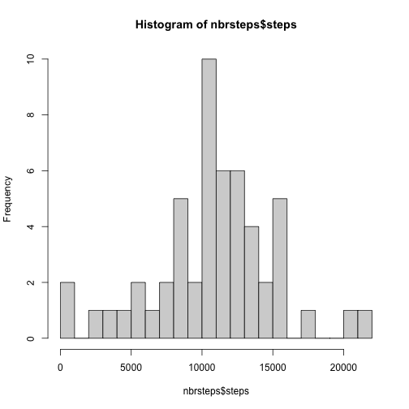
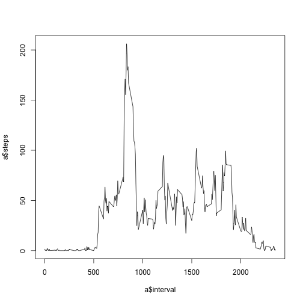
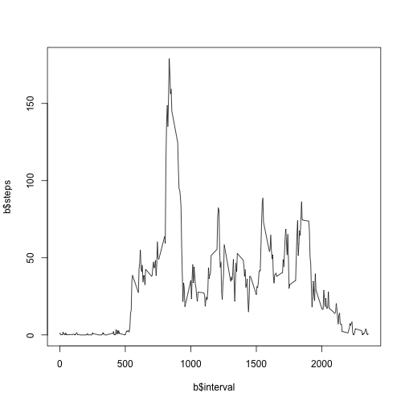
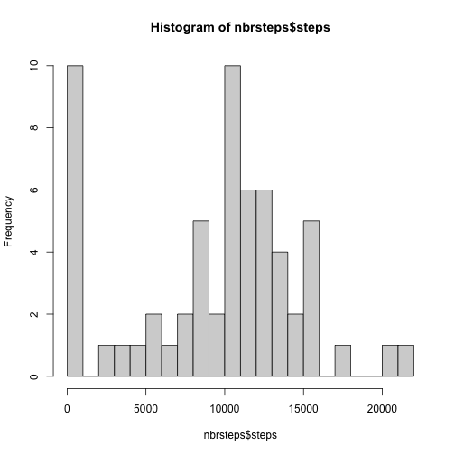
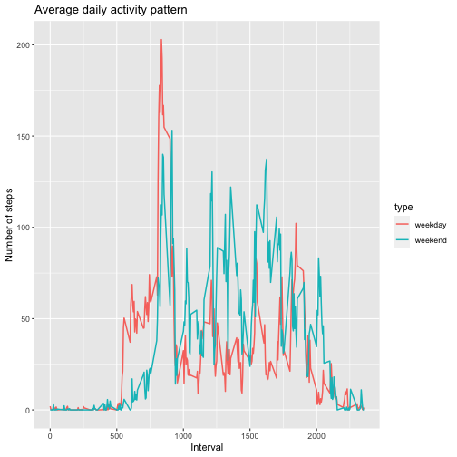

# Peer assignment

Show any code that is needed to:

Load the data (i.e. read.csv()) and process/transform the data (if necessary) into a format suitable for your analysis

```r
library(dplyr)
library(tidyr)
data <- read.csv('activity.csv')
data$timestamp <- strptime(paste(data$date,
                formatC(data$interval,digits =3,flag='0')),"%Y-%m-%d %H%M")
```


```r
data <- read.csv("activity.csv", header = TRUE, sep = ",")
data$date_revised <- as.Date(data$date)
data$interval_revised <- sprintf("%04d", data$interval)
data$interval_time <- strptime(data$interval_revised, format = "%H%M")
```


What is mean total number of steps taken per day?

```r
aggregate(steps ~ date, data, mean)
```

```
##          date      steps
## 1  2012-10-02  0.4375000
## 2  2012-10-03 39.4166667
## 3  2012-10-04 42.0694444
## 4  2012-10-05 46.1597222
## 5  2012-10-06 53.5416667
## 6  2012-10-07 38.2465278
## 7  2012-10-09 44.4826389
## 8  2012-10-10 34.3750000
## 9  2012-10-11 35.7777778
## 10 2012-10-12 60.3541667
## 11 2012-10-13 43.1458333
## 12 2012-10-14 52.4236111
## 13 2012-10-15 35.2048611
## 14 2012-10-16 52.3750000
## 15 2012-10-17 46.7083333
## 16 2012-10-18 34.9166667
## 17 2012-10-19 41.0729167
## 18 2012-10-20 36.0937500
## 19 2012-10-21 30.6284722
## 20 2012-10-22 46.7361111
## 21 2012-10-23 30.9652778
## 22 2012-10-24 29.0104167
## 23 2012-10-25  8.6527778
## 24 2012-10-26 23.5347222
## 25 2012-10-27 35.1354167
## 26 2012-10-28 39.7847222
## 27 2012-10-29 17.4236111
## 28 2012-10-30 34.0937500
## 29 2012-10-31 53.5208333
## 30 2012-11-02 36.8055556
## 31 2012-11-03 36.7048611
## 32 2012-11-05 36.2465278
## 33 2012-11-06 28.9375000
## 34 2012-11-07 44.7326389
## 35 2012-11-08 11.1770833
## 36 2012-11-11 43.7777778
## 37 2012-11-12 37.3784722
## 38 2012-11-13 25.4722222
## 39 2012-11-15  0.1423611
## 40 2012-11-16 18.8923611
## 41 2012-11-17 49.7881944
## 42 2012-11-18 52.4652778
## 43 2012-11-19 30.6979167
## 44 2012-11-20 15.5277778
## 45 2012-11-21 44.3993056
## 46 2012-11-22 70.9270833
## 47 2012-11-23 73.5902778
## 48 2012-11-24 50.2708333
## 49 2012-11-25 41.0902778
## 50 2012-11-26 38.7569444
## 51 2012-11-27 47.3819444
## 52 2012-11-28 35.3576389
## 53 2012-11-29 24.4687500
```
## For this part of the assignment, you can ignore the missing values in the dataset.

### Calculate the total number of steps taken per day

```r
nbrsteps <- aggregate(steps ~ date, data, sum)
```


If you do not understand the difference between a histogram and a barplot, research the difference between them. Make a histogram of the total number of steps taken each day

```r
hist(nbrsteps$steps, breaks=20)
```



Calculate and report the mean and median of the total number of steps taken per day

```r
meansteps <- mean(data$steps, na.rm = TRUE)
mediansteps <- median(data$steps, na.rm = TRUE)
print(meansteps)
```

```
## [1] 37.3826
```

```r
print(mediansteps)
```

```
## [1] 0
```

## What is the average daily activity pattern?

Make a time series plot (i.e. type = "l") of the 5-minute interval (x-axis) and the average number of steps taken, averaged across all days (y-axis)

```r
a <- aggregate(steps ~ interval, data, mean)
plot(a$interval, a$steps, type="l")
```




Which 5-minute interval, on average across all the days in the dataset, contains the maximum number of steps?

```r
a <- aggregate(steps ~ interval, data, mean)
a[which.max(a[,'steps']),'interval']
```

```
## [1] 835
```

```r
a[which.max(a[,'steps']),'steps']
```

```
## [1] 206.1698
```


## Imputing missing values

Note that there are a number of days/intervals where there are missing values (coded as NA). The presence of missing days may introduce bias into some calculations or summaries of the data.

Calculate and report the total number of missing values in the dataset (i.e. the total number of rows with NAs)

```r
sum(is.na(data))
```

```
## [1] 2304
```


Devise a strategy for filling in all of the missing values in the dataset. The strategy does not need to be sophisticated. For example, you could use the mean/median for that day, or the mean for that 5-minute interval, etc.


```r
tidydata <- data %>% fill(steps, .direction = "downup")
```

Create a new dataset that is equal to the original dataset but with the missing data filled in.

```r
head(tidydata)
```

```
##   steps       date interval date_revised interval_revised
## 1     0 2012-10-01        0   2012-10-01             0000
## 2     0 2012-10-01        5   2012-10-01             0005
## 3     0 2012-10-01       10   2012-10-01             0010
## 4     0 2012-10-01       15   2012-10-01             0015
## 5     0 2012-10-01       20   2012-10-01             0020
## 6     0 2012-10-01       25   2012-10-01             0025
##         interval_time
## 1 2021-01-02 00:00:00
## 2 2021-01-02 00:05:00
## 3 2021-01-02 00:10:00
## 4 2021-01-02 00:15:00
## 5 2021-01-02 00:20:00
## 6 2021-01-02 00:25:00
```


Make a histogram of the total number of steps taken each day and Calculate and report the mean and median total number of steps taken per day. Do these values differ from the estimates from the first part of the assignment? What is the impact of imputing missing data on the estimates of the total daily number of steps?

```r
b <- aggregate(steps ~ interval, tidydata, mean)
plot(b$interval, b$steps, type="l")
```



```r
nbrsteps <- aggregate(steps ~ date, tidydata, sum)
hist(nbrsteps$steps, breaks=20)
```


## Are there differences in activity patterns between weekdays and weekends?
For this part the weekdays() function may be of some help here. Use the dataset with the filled-in missing values for this part.

```r
tidydata$weekday <- factor(weekdays(as.Date(tidydata$date,'%Y-%m-%d')),
                               levels = c("maandag", "dinsdag", "woensdag", "donderdag",
                                          "vrijdag", "zaterdag", "zondag"))
merge(aggregate(steps ~ weekday, tidydata, mean),
      aggregate(steps ~ weekday, tidydata, median),
      by='weekday')
```

```
##     weekday  steps.x steps.y
## 1   dinsdag 31.07485       0
## 2 donderdag 25.34799       0
## 3   maandag 26.93827       0
## 4   vrijdag 33.37886       0
## 5  woensdag 36.39120       0
## 6  zaterdag 38.08507       0
## 7    zondag 37.30208       0
```


Create a new factor variable in the dataset with two levels – “weekday” and “weekend” indicating whether a given date is a weekday or weekend day.

```r
tidydata[,'workingday'] <- tidydata[,'weekday']

library(forcats)
tidydata[,'workingday'] <- fct_collapse(tidydata$workingday,
  weekday = c("maandag", "dinsdag", "woensdag", "donderdag","vrijdag"),
  weekend = c("zaterdag", "zondag"))

weekdays <- tidydata %>% filter(workingday == "weekday") %>% group_by(interval) %>% summarise(avg=mean(steps))
```

```
## `summarise()` ungrouping output (override with `.groups` argument)
```

```r
weekdays[,'type'] <- "weekday"
weekends <- tidydata %>% filter(workingday == "weekend") %>% group_by(interval) %>% summarise(avg=mean(steps))
```

```
## `summarise()` ungrouping output (override with `.groups` argument)
```

```r
weekends[,'type'] <- "weekend"
total <- rbind(weekdays, weekends)
```


Make a panel plot containing a time series plot (i.e. type = "l") of the 5-minute interval (x-axis) and the average number of steps taken, averaged across all weekday days or weekend days (y-axis). See the README file in the GitHub repository to see an example of what this plot should look like using simulated data.

```r
library(ggplot2)
library(scales)

ggplot(total,aes(interval,avg)) + geom_line(aes(colour=type), size = .7) + labs(x = "Interval", y="Number of steps", title = "Average daily activity pattern")
```



